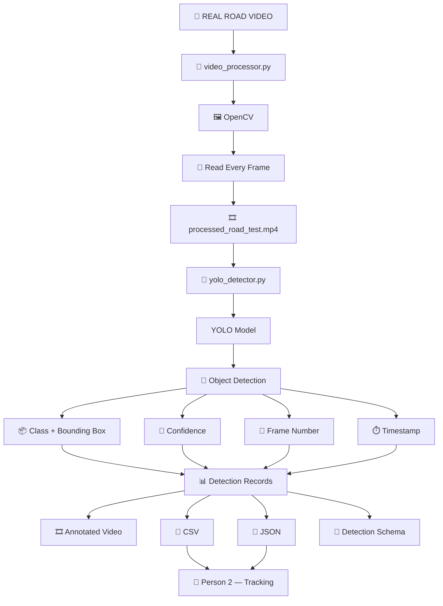

# 🚦 AcciVision — Person 1
## 🎥 Video Processing + 🤖 YOLO Object Detection

> **Person 1 is the first computer-vision stage of the AI Road Safety system.**
>
> **Input:** Road traffic video  
> **Processing:** OpenCV → YOLO  
> **Output:** Annotated video + CSV + JSON  
> **Handoff:** Person 2 — Object Tracking

---

## 🌟 Module Status

| Component | Status |
|---|---|
| 🎥 Video input | ✅ Ready |
| 🖼️ OpenCV frame processing | ✅ Ready |
| 📊 Video information extraction | ✅ Ready |
| 🤖 YOLO model loading | ✅ Ready |
| 🔎 Object detection | ✅ Ready |
| 📦 Bounding boxes | ✅ Ready |
| 🎯 Confidence scores | ✅ Ready |
| 🔢 Frame numbers | ✅ Ready |
| ⏱️ Timestamps | ✅ Ready |
| 🎞️ Annotated video | ✅ Ready |
| 📄 CSV detection output | ✅ Ready |
| 🧾 JSON detection output | ✅ Ready |
| 📐 Detection schema | ✅ Ready |
| 🔄 Person 2 handoff | ✅ Ready |

---

# 📚 Table of Contents

- [1. Overview](#1-overview)
- [2. Person 1 Role](#2-person-1-role)
- [3. Architecture](#3-architecture)
- [4. Project Structure](#4-project-structure)
- [5. Technologies](#5-technologies)
- [6. Input Video](#6-input-video)
- [7. OpenCV Processing](#7-opencv-processing)
- [8. YOLO Detection](#8-yolo-detection)
- [9. Detection Data](#9-detection-data)
- [10. Output Files](#10-output-files)
- [11. Installation](#11-installation)
- [12. Running the Complete Pipeline](#12-running-the-complete-pipeline)
- [13. Verifying Outputs](#13-verifying-outputs)
- [14. Person 1 → Person 2 Handoff](#14-person-1--person-2-handoff)
- [15. Testing Checklist](#15-testing-checklist)
- [16. Troubleshooting](#16-troubleshooting)
- [17. GitHub Notes](#17-github-notes)
- [18. Deliverables](#18-deliverables)
- [19. Final Summary](#19-final-summary)

---

# 1. Overview

Person 1 is responsible for:

> **Video Processing + YOLO Object Detection**

The module takes a road video, reads it frame-by-frame using OpenCV, performs YOLO object detection, and creates structured detection information that can be consumed by Person 2.

### 🔁 End-to-End Flow



---

# 2. Person 1 Role

## 🎯 Main Responsibility

Person 1 converts:

```text
🎥 Road Video
     ↓
🖼️ OpenCV Processing
     ↓
🤖 YOLO Detection
     ↓
📊 Structured Detection Data
     ↓
👤 Person 2 Tracking
```

## ✅ Person 1 Handles

- Video input
- OpenCV processing
- Frame-by-frame reading
- Video information
- YOLO model loading
- Object detection
- Object classes
- Confidence scores
- Bounding boxes
- Frame numbers
- Timestamps
- Annotated video
- CSV output
- JSON output
- Detection schema

## ❌ Person 1 Does Not Handle

- Object tracking
- Tracking IDs
- CNN/LSTM
- Accident prediction
- Alert generation
- Dashboard
- Database integration

These belong to the other project modules.

---

# 3. Architecture

```text
                    ┌──────────────────────┐
                    │   🎥 ROAD VIDEO      │
                    └──────────┬───────────┘
                               │
                               ▼
                    ┌──────────────────────┐
                    │ video_processor.py   │
                    └──────────┬───────────┘
                               │
                               ▼
                    ┌──────────────────────┐
                    │       OpenCV         │
                    │   Frame Processing   │
                    └──────────┬───────────┘
                               │
                               ▼
                    ┌──────────────────────┐
                    │ processed_road_test  │
                    │       .mp4           │
                    └──────────┬───────────┘
                               │
                               ▼
                    ┌──────────────────────┐
                    │ yolo_detector.py     │
                    └──────────┬───────────┘
                               │
                               ▼
                    ┌──────────────────────┐
                    │     🤖 YOLO Model    │
                    └──────────┬───────────┘
                               │
                               ▼
                    ┌──────────────────────┐
                    │  Object Detection    │
                    └──────────┬───────────┘
                               │
             ┌─────────────────┼─────────────────┐
             ▼                 ▼                 ▼
          🏷️ Class        🎯 Confidence      📦 Bounding Box
             │                 │                 │
             └─────────────────┼─────────────────┘
                               │
                               ▼
                    ┌──────────────────────┐
                    │   Detection Record   │
                    │                      │
                    │ frame_number         │
                    │ timestamp_sec        │
                    │ class                │
                    │ x1,y1,x2,y2          │
                    │ confidence           │
                    └──────────┬───────────┘
                               │
              ┌────────────────┼────────────────┐
              ▼                ▼                ▼
       🎞️ Annotated       📄 CSV            🧾 JSON
           Video          Output            Output
              │                │                │
              └────────────────┼────────────────┘
                               ▼
                       👤 PERSON 2
                     OBJECT TRACKING
```

---

# 4. Project Structure

```text
person_1_video_yolo/
│
├── detection/
│   └── yolo_detector.py
│
├── input/
│   └── raw/
│       ├── frames/
│       ├── mock_accident.mp4
│       ├── mock_normal.mp4
│       ├── real_road_test.mp4
│       └── road_test.mp4
│
├── output/
│   ├── annotated_road_test.mp4
│   ├── detection_schema.json
│   ├── processed_road_test.mp4
│   ├── yolo_detections.csv
│   └── yolo_detections.json
│
├── preprocessing/
│   └── video_processor.py
│
└── README.md
```

The combined repository is organized into multiple team modules:

```text
dl_project/
│
├── integration_contracts/
├── person_1_video_yolo/
├── person_2_tracking/
├── person_3_dataset_cnn_lstm/
├── person_4_integration_alerts_dashboard/
├── tests/
├── README.md
├── START_HERE.md
├── requirements.txt
└── main.py
```

---

# 5. Technologies

| Technology | Purpose |
|---|---|
| 🐍 Python | Main programming language |
| 🖼️ OpenCV | Video processing |
| 🤖 YOLO | Object detection |
| 📦 Ultralytics | YOLO implementation |
| 🔢 NumPy | Numerical operations |
| 📄 CSV | Tabular detection output |
| 🧾 JSON | Structured detection output |
| 📁 pathlib | File and folder handling |

---

# 6. Input Video

Input videos are stored in:

```text
person_1_video_yolo/input/raw/
```

Supported formats:

```text
.mp4
.avi
.mov
.mkv
```

Example:

```text
person_1_video_yolo/input/raw/real_road_test.mp4
```

Test videos can include:

```text
mock_accident.mp4
mock_normal.mp4
road_test.mp4
real_road_test.mp4
```

---

# 7. OpenCV Processing

The OpenCV program is:

```text
person_1_video_yolo/preprocessing/video_processor.py
```

## What it does

1. Finds the input video.
2. Opens the video with OpenCV.
3. Reads video information.
4. Reads every frame.
5. Writes the frames into the processed output video.
6. Releases video resources.

### Processing Flow

```text
🎥 Input Video
      ↓
cv2.VideoCapture()
      ↓
📊 Read FPS / Width / Height / Frame Count
      ↓
🔢 Read Frame
      ↓
📝 Process Frame
      ↓
💾 Write Frame
      ↓
🎞️ Processed Video
```

## Example Video Information

For the tested road video:

```text
FPS: 24.0
Width: 1280
Height: 720
Frame count: 240
Duration: 10.0 seconds
```

Duration:

```text
Duration = Frame Count / FPS
         = 240 / 24
         = 10 seconds
```

## OpenCV Output

```text
person_1_video_yolo/output/processed_road_test.mp4
```

---

# 8. YOLO Detection

The YOLO detector is:

```text
person_1_video_yolo/detection/yolo_detector.py
```

## YOLO Responsibilities

The detector:

1. Loads the YOLO model.
2. Opens the processed video.
3. Reads video frames.
4. Runs YOLO on each frame.
5. Identifies detected classes.
6. Gets confidence values.
7. Gets bounding boxes.
8. Records frame numbers.
9. Records timestamps.
10. Creates annotated video.
11. Creates CSV output.
12. Creates JSON output.

### YOLO Flow

```text
🎞️ Processed Video
        ↓
🔢 Read Frame
        ↓
🤖 YOLO Model
        ↓
🔎 Detect Objects
        ↓
┌────────────┬────────────┬────────────┐
│            │            │            │
▼            ▼            ▼
🏷️ Class   🎯 Confidence  📦 Bounding Box
│            │            │
└────────────┴────────────┘
             ↓
      📊 Detection Record
```

---

# 9. Detection Data

Every YOLO detection contains:

| Field | Meaning |
|---|---|
| `frame_number` | Exact video frame |
| `timestamp_sec` | Time of frame in seconds |
| `class` | Detected object class |
| `x1` | Left bounding-box coordinate |
| `y1` | Top bounding-box coordinate |
| `x2` | Right bounding-box coordinate |
| `y2` | Bottom bounding-box coordinate |
| `confidence` | YOLO confidence score |

## Example

```json
{
    "frame_number": 1,
    "timestamp_sec": 0.0,
    "class": "car",
    "x1": 636,
    "y1": 276,
    "x2": 760,
    "y2": 372,
    "confidence": 0.76
}
```

### Bounding Box

```text
(x1,y1)
   ┌─────────────────────────┐
   │                         │
   │        🚗 OBJECT        │
   │                         │
   └─────────────────────────┘
                         (x2,y2)
```

Coordinates are in **pixels**.

---

# 10. Output Files

Person 1 produces:

```text
person_1_video_yolo/output/
│
├── 🎞️ processed_road_test.mp4
├── 🎞️ annotated_road_test.mp4
├── 📄 yolo_detections.csv
├── 🧾 yolo_detections.json
└── 📐 detection_schema.json
```

## Output Purpose

| File | Purpose |
|---|---|
| `processed_road_test.mp4` | OpenCV processed video |
| `annotated_road_test.mp4` | Video with YOLO annotations |
| `yolo_detections.csv` | Detection data in CSV |
| `yolo_detections.json` | Detection data in JSON |
| `detection_schema.json` | Common detection-data contract |

---

## 🎞️ 10.1 Processed Video

```text
processed_road_test.mp4
```

Flow:

```text
Original Video
     ↓
   OpenCV
     ↓
Processed Video
```

---

## 🎞️ 10.2 Annotated Video

```text
annotated_road_test.mp4
```

The video contains YOLO detection annotations such as bounding boxes, classes, and confidence information.

It is useful for visually verifying the model output.

---

## 📄 10.3 CSV

```text
yolo_detections.csv
```

Example:

```csv
frame_number,timestamp_sec,class,x1,y1,x2,y2,confidence
1,0.0,car,636,276,760,372,0.76
1,0.0,person,400,200,450,350,0.91
2,0.0417,car,640,278,765,374,0.79
```

---

## 🧾 10.4 JSON

```text
yolo_detections.json
```

Example:

```json
[
    {
        "frame_number": 1,
        "timestamp_sec": 0.0,
        "class": "car",
        "x1": 636,
        "y1": 276,
        "x2": 760,
        "y2": 372,
        "confidence": 0.76
    },
    {
        "frame_number": 1,
        "timestamp_sec": 0.0,
        "class": "person",
        "x1": 400,
        "y1": 200,
        "x2": 450,
        "y2": 350,
        "confidence": 0.91
    }
]
```

---

## 📐 10.5 Detection Schema

File:

```text
detection_schema.json
```

Example:

```json
{
    "required": [
        "frame_number",
        "timestamp_sec",
        "class",
        "x1",
        "y1",
        "x2",
        "y2",
        "confidence"
    ],
    "bbox_format": "x1,y1,x2,y2",
    "coordinate_system": "pixel"
}
```

---

# 11. Installation

Recommended Python version:

```text
Python 3.11
```

If using Conda:

```powershell
conda create -n road_safety_p1 python=3.11 pip
```

Activate:

```powershell
conda activate road_safety_p1
```

Install dependencies:

```powershell
pip install -r requirements.txt
```

Important packages:

```text
opencv-python
ultralytics
numpy
```

---

# 12. Running the Complete Pipeline

## Step 1 — Activate Environment

```powershell
conda activate road_safety_p1
```

Check:

```powershell
python --version
```

---

## Step 2 — Open Project Root

Make sure the terminal is at:

```text
dl_project/
```

Example:

```text
PS C:\Users\moksh\OneDrive\Laptop Storage\Projects\dl_project>
```

---

## Step 3 — Add Input Video

Place a road video inside:

```text
person_1_video_yolo/input/raw/
```

Example:

```text
person_1_video_yolo/input/raw/real_road_test.mp4
```

---

## Step 4 — Run OpenCV

```powershell
python person_1_video_yolo/preprocessing/video_processor.py
```

Wait for:

```text
Processing completed.
```

---

## Step 5 — Verify Processed Video

Check:

```text
person_1_video_yolo/output/processed_road_test.mp4
```

---

## Step 6 — Run YOLO

```powershell
python person_1_video_yolo/detection/yolo_detector.py
```

Expected startup message:

```text
YOLO model loaded successfully!
```

---

## Step 7 — Verify YOLO Outputs

Check:

```text
person_1_video_yolo/output/
```

Expected:

```text
processed_road_test.mp4
annotated_road_test.mp4
yolo_detections.csv
yolo_detections.json
detection_schema.json
```

---

# 13. Verifying Outputs

Use this checklist after execution:

### 🎥 Video

```text
[ ] Input video opens
[ ] Processed video exists
[ ] Annotated video exists
```

### 🤖 YOLO

```text
[ ] YOLO model loads
[ ] Objects are detected
[ ] Classes are recorded
[ ] Confidence values are recorded
[ ] Bounding boxes are recorded
```

### 📊 Detection Data

```text
[ ] Frame numbers are recorded
[ ] Timestamps are recorded
[ ] CSV exists
[ ] JSON exists
[ ] Detection schema exists
```

### 🔄 Handoff

```text
[ ] Person 2 can read CSV
[ ] Person 2 can read JSON
[ ] Frame number is available
[ ] Bounding box coordinates are available
[ ] Class is available
```

---

# 14. Person 1 → Person 2 Handoff

Person 1 ends at:

```text
YOLO Object Detection
        ↓
Detection Records
```

Person 2 starts with:

```text
Detection Records
        ↓
Object Tracking
        ↓
Tracking IDs
```

## Handoff Files

Person 2 can use:

```text
person_1_video_yolo/output/yolo_detections.csv
```

or:

```text
person_1_video_yolo/output/yolo_detections.json
```

## Data Contract

Person 2 should expect:

```text
frame_number
timestamp_sec
class
x1
y1
x2
y2
confidence
```

### Handoff Diagram

```text
          👤 PERSON 1
               |
               v
        🎥 Video Processing
               |
               v
          🤖 YOLO Detection
               |
               v
       📊 Detection Records
               |
        ┌──────┴──────┐
        ▼             ▼
      📄 CSV        🧾 JSON
        |             |
        └──────┬──────┘
               |
               v
          👤 PERSON 2
               |
               v
        🔄 Object Tracking
               |
               v
         🆔 Tracking IDs
```

---

# 15. Testing Checklist

Use these videos for testing when available:

```text
mock_accident.mp4
mock_normal.mp4
road_test.mp4
real_road_test.mp4
```

## Complete Test

```text
[ ] Video opens correctly
[ ] FPS is detected
[ ] Width is detected
[ ] Height is detected
[ ] Frame count is detected
[ ] Duration is calculated
[ ] Every frame is processed
[ ] Processed video is generated
[ ] YOLO loads successfully
[ ] Objects are detected
[ ] Classes are generated
[ ] Confidence scores are generated
[ ] Bounding boxes are generated
[ ] Frame numbers are generated
[ ] Timestamps are generated
[ ] Annotated video is generated
[ ] CSV is generated
[ ] JSON is generated
[ ] Detection schema is available
[ ] Person 2 can consume the detection data
```

---

# 16. Troubleshooting

<details>
<summary>❌ No video found</summary>

If the program reports:

```text
ERROR: No video file found.
```

Place a supported video inside:

```text
person_1_video_yolo/input/raw/
```

Supported formats:

```text
.mp4
.avi
.mov
.mkv
```

</details>

<details>
<summary>❌ OpenCV cannot open the video</summary>

If the program reports:

```text
ERROR: Could not open the video.
```

Check:

- Video path
- File extension
- Video integrity
- OpenCV installation

</details>

<details>
<summary>❌ YOLO model cannot load</summary>

Check:

- Python environment
- Ultralytics installation
- Model file
- Model path
- Required dependencies

</details>

<details>
<summary>❌ CSV or JSON is missing</summary>

Check that `yolo_detector.py` completed without an error.

Then inspect:

```text
person_1_video_yolo/output/
```

</details>

---

# 17. GitHub Notes

Large files can make a Git repository unnecessarily large.

The project `.gitignore` may exclude:

```text
.venv/
venv/
__pycache__/
*.pyc
*.mp4
*.avi
*.mov
*.mkv
*.pt
```

Therefore:

- Source code should be committed.
- Documentation should be committed.
- Schemas should be committed.
- Large videos may be excluded.
- YOLO model weights may be excluded.

If large binary files must be shared through GitHub, Git LFS or another suitable storage solution can be considered.

---

# 18. Deliverables

## 🧑‍💻 Source Code

```text
1. video_processor.py
2. yolo_detector.py
```

## 🎞️ Video Outputs

```text
3. processed_road_test.mp4
4. annotated_road_test.mp4
```

## 📊 Detection Outputs

```text
5. yolo_detections.csv
6. yolo_detections.json
```

## 📐 Schema

```text
7. detection_schema.json
```

## 📚 Documentation

```text
8. README.md
```

---

# 19. Final Summary

## 🚦 Person 1 in One Diagram

```text
                 🎥 REAL ROAD VIDEO
                         |
                         v
                🐍 OpenCV Processing
                         |
                         v
                 🔢 Frame Reading
                         |
                         v
              🎞️ Processed Video
                         |
                         v
                   🤖 YOLO Model
                         |
                         v
                 🔎 Object Detection
                         |
          +--------------+--------------+
          |              |              |
          v              v              v
       🏷️ Class      🎯 Confidence   📦 Bounding Box
          |              |              |
          +--------------+--------------+
                         |
                         v
                   🔢 Frame Number
                         |
                         v
                    ⏱️ Timestamp
                         |
                         v
                📊 Detection Record
                         |
          +--------------+--------------+
          |              |              |
          v              v              v
      🎞️ Video        📄 CSV          🧾 JSON
                         |
                         v
                    👤 PERSON 2
                 🔄 OBJECT TRACKING
```

---

## 🏁 Person 1's Main Job

> **VIDEO → OPENCV → YOLO → DETECTION DATA → PERSON 2**

### Detection Data Contract

```text
frame_number
timestamp_sec
class
x1
y1
x2
y2
confidence
```

### Final Output

```text
🎞️ processed_road_test.mp4
🎞️ annotated_road_test.mp4
📄 yolo_detections.csv
🧾 yolo_detections.json
📐 detection_schema.json
```

---

## 🎉 Person 1 Completion

Person 1 is complete when:

```text
🎥 Video
   ↓
🖼️ OpenCV
   ↓
🤖 YOLO
   ↓
🔎 Detection
   ↓
📊 CSV + JSON
   ↓
🎞️ Annotated Video
   ↓
👤 Person 2
```

**Person 1 = Video Processing + YOLO Object Detection + Detection Data Handoff**
